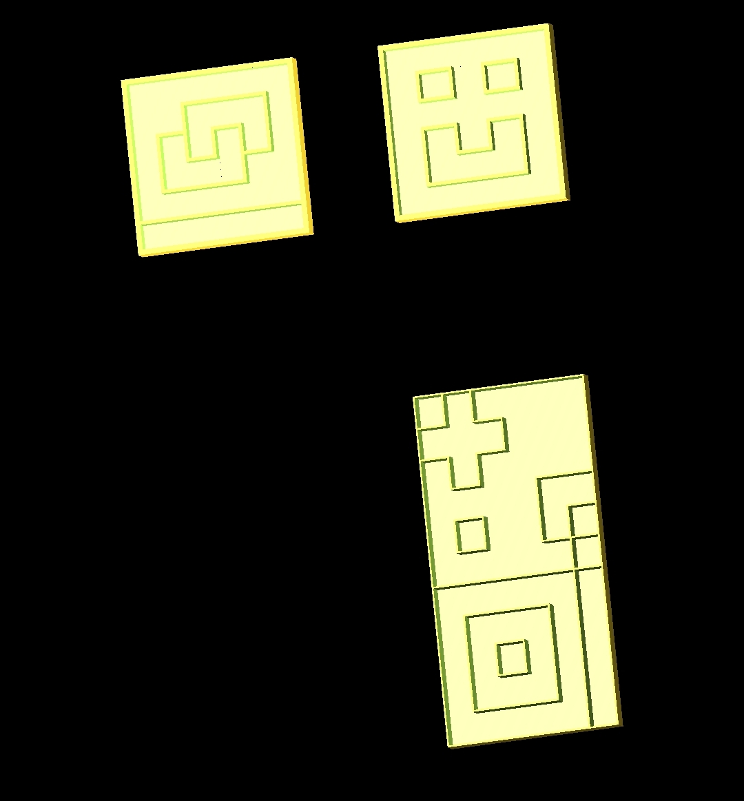

# Highly customisable box scad

Well, is not that highly customisable in my opinion but at least allows to divide the box easily

Inspired on how CSS allows you to make grid patterns I made this program to allow you to make even more complex designs to organize your stuff 

## Preview

